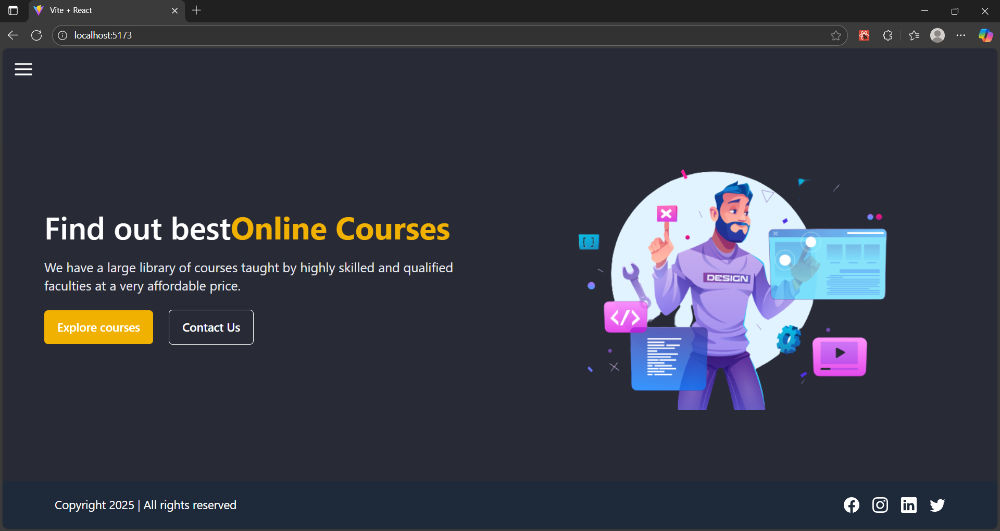
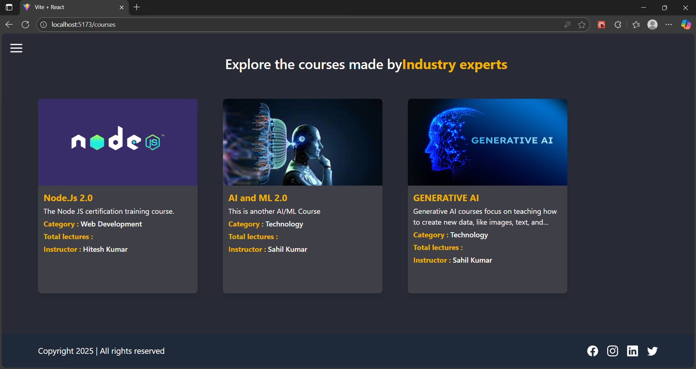

# LMS-E
A comprehensive, production-ready Learning Management System (LMS) featuring user authentication, course & lecture management, payment integration, dashboards, and a beautiful interface with Tailwind CSS. Built with React (Vite), Redux Toolkit, Node.js, Express, MongoDB, Cloudinary, Razorpay, and more.

🚀 Features
- Modern UI with Tailwind CSS + DaisyUI
- JWT Authentication & User Roles: Student, Instructor, and Admin
- Course Management: Create/edit/delete/view courses, lectures, and details
- Secure Payments: Integrated with Razorpay for course enrollments
- Admin Dashboard: Overview stats, user and course management
- Profile & Enrollment: Update profile, enroll in/track courses, view enrolled courses
- Lecture Management: Add videos/materials to courses
- Email Notifications: Signup, payment, and event triggers via Nodemailer
- Cloudinary Integration: File upload/storage for course media
- Comprehensive Error Handling: Custom error utils and structured endpoints
- Redux State Management: Separate slices for authentication, courses, lectures, payments, stats, etc.

📦 Tech Stack
- Frontend:
    - React (Vite scaffold)
    - Redux Toolkit
    - React Router
    - Tailwind CSS, DaisyUI
    - Axios, Chart.js
- Backend:
    - Node.js, Express.js
    - MongoDB, Mongoose
    - JWT, bcryptjs, Multer
    - Cloudinary, Nodemailer
    - Razorpay for payments
    - dotenv, cors

📂 Project Structure
```
LMS-E/
├── client/                   # React + Vite + TailwindCSS frontend
│   ├── src/
│   │   ├── Assets/           # Images, icons, etc.
│   │   ├── Components/       # UI components
│   │   ├── Constants/        # App-wide constants/config
│   │   ├── Helpers/          # Utility helpers
│   │   ├── Layouts/          # Layout wrappers
│   │   ├── Pages/            # Main route pages
│   │   │   ├── Course/
│   │   │   ├── Dashboard/
│   │   │   ├── Payment/
│   │   │   └── User/
│   │   ├── Redux/            # State management (see Slices/)
│   │   │   ├── Slices/
│   │   │   └── store.js
│   │   ├── App.jsx
│   │   ├── main.jsx
│   │   └── index.css         # Tailwind directives
│   ├── tailwind.config.js
│   ├── postcss.config.js
│   └── package.json
├── server/                   # Node.js/Express backend
│   ├── controllers/
│   │   ├── course.controller.js
│   │   ├── miscellaneous.controller.js
│   │   ├── payment.controller.js
│   │   └── user.controller.js
│   ├── models/               # Mongoose schemas (user, course, payment)
│   ├── routes/               # REST API endpoints
│   ├── middlewares/          # Auth/error handling/multer
│   ├── config/               # Cloudinary, database, env
│   ├── utils/                # Utility files (appError.js, sendEmail.js, error.util.js)
│   ├── app.js
│   ├── server.js
│   ├── .env.example
│   └── package.json
├── .vscode/
├── .gitignore
├── README.md

```

📦 Key Dependencies
Frontend (client):
  - react, react-dom
  - react-router-dom
  - redux, @reduxjs/toolkit, react-redux
  - axios
  - tailwindcss, daisyui, postcss, autoprefixer
  - chart.js

use npm install for all dependencies

Backend (server):
  - express
  - mongoose
  - jsonwebtoken
  - bcryptjs
  - multer
  - dotenv
  - cloudinary
  - nodemailer
  - razorpay
  - cors
  - nodemon (dev)

🛠️ Installation & Setup

1. Clone the Repository
```
git clone https://github.com/sahilk-dev/LMS-E.git
cd LMS-E
```
2.Setup Backend
```
cd server
npm install
# Create .env file as per server/.env.example
npm run dev
```
3. Setup Frontend
```
cd ../client
npm install
# Tailwind CSS and DaisyUI are already preconfigured
npm run dev
```
Configure Environment:
- Update MongoDB, JWT, Cloudinary, SMTP, Razorpay keys in server/.env
- Frontend and backend run on separate ports (3000 and 5000 by default)

⚡ API Overview
- /api/user — Registration, login, profile, update profile, user management
- /api/course — Create, list, update, delete courses, add/get lectures
- /api/payment — Course purchase/enrollment via Razorpay
- /api/miscellaneous — Other supporting routes

Each route includes authentication and error handling middleware as needed.

📈 Redux Slices
  - AuthSlice: Authentication & user state
  - CourseSlice: Courses & lectures
  - LectureSlice: Per-lecture management
  - RazorpaySlice: Payment flows
  - StatSlice: Dashboard statistics

🧑‍💻 Main Pages
  - Home (Landing)
  - Login / Register
  - Dashboard (role-based: admin, instructor, student)
  - Course List, Course Details
  - Payment/Checkout
  - Profile, Enrollment List

📬 Email & Cloudinary Integration
  - All uploads (course images, lecture content) stored on Cloudinary
  - Nodemailer used for transactional email (confirmation, password reset, etc.)


## 📸 Screenshots

<p align="center">
  
  
</p>

<p align="center">
  
  
</p>

<p align="center">
  
</p>


🤝 Contributing
  - Fork this repo
  - Create a new branch: git checkout -b feature/YourFeature
  - Commit your changes: git commit -m "Add feature"
  - Push the branch: git push origin feature/YourFeature
  - Open a Pull Request

📄 License
MIT License © 2025 [Sahil Kamila]